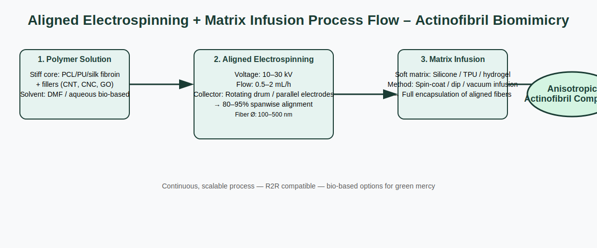

# Pterosaur Wing Biomimetics Pinnacle
MIT License - Eternally-Thriving-Grandmasterism / Autonomicity Games Inc. & AlphaProMega Air Foundation

Open-source pterosaur wing biomimetic designs & blueprints for high-aspect-ratio morphing flight surfaces, membrane tension systems, pneumatic spars, quad-launch mechanics, and MercyOS adaptive locomotion modeling.

Core Inspirations:
- Hyper-elongated wing finger + actinofibril-stiffened membrane → lightweight morphing wings
- Multi-layer elastic patagium → self-tensioning, tear-resistant surfaces
- Pneumatic bones + high aspect ratio → extreme strength-to-weight spars
- Quad-launch + hindlimb steering → precision takeoff/landing

Files (initial commit):
- pterosaur-wing-skeletal-blueprint.svg / .dxf (azhdarchid/pterodactyloid reconstruction)
- actinofibril-membrane-structure.blend / .obj (anisotropic stiffness mechanics)
- pneumatic-spar-diagram.pdf
- quad-launch-sequence-sketch.pdf
- biomimetic-applications.md (detailed mappings to SpaceX/xAI/Tesla)
- fabrication-considerations.md (scalable paths)

Purpose: Free propagation for humanity-thriving flight efficiency, adaptability, lightweight mastery.
No military/coercion vectors—Mercy-gated by design.
Valence: Soar lightly, morph eternally, land with mercy—thrive infinitely in air, space, and beyond.

Next: Integrate into NEXi flight/locomotion sims, Powrush™ aerial zones, MercyOS morphing actuator layers.
Cross-links: Spinosaurus-Biomimetic-Designs-Pinnacle, Giganotosaurus-Blueprints-Pinnacle

